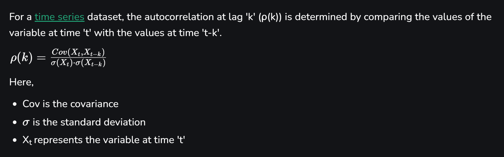
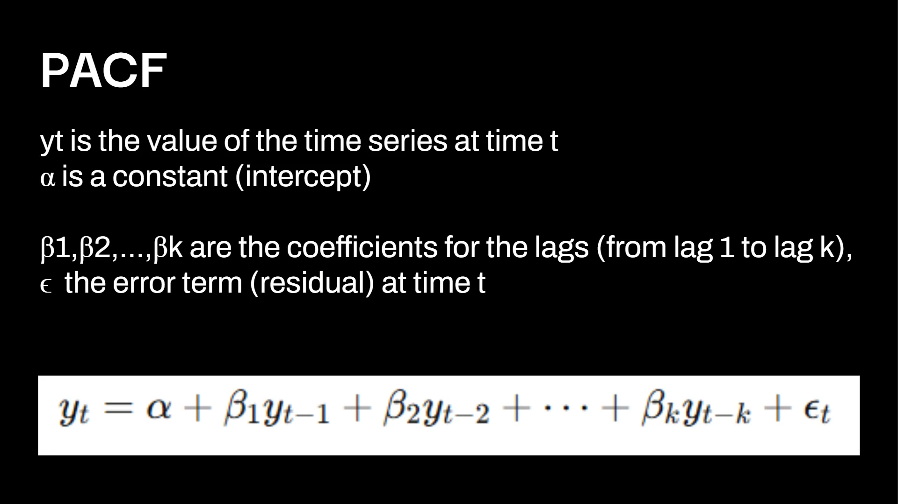
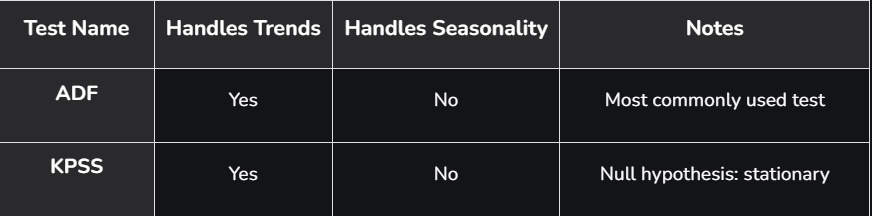

# Day 1

Refer these terms : Time series and its components ( Trend , Seasonality , Noise)

## Lag

- In time series data, a lag refers to a previous time step’s value of a variable.
- It represents how past values influence the present.
- Lag is simply past values of a time series .

Lag 1 → $Y_{t-1}$  
Lag 2 → $Y_{t-2}$

## Autocorrelation (ACF) and Partial Autocorrelation (PACF)

[Autocorrelation (ACF) and Partial Autocorrelation (PACF)](https://www.geeksforgeeks.org/machine-learning/autocorrelation/)

## Stationarity

- A stationary time series is one whose statistical properties, such as mean, variance, and autocorrelation, remain constant over time
- Constant mean : no upward or downward trend
- Constant variance : no change in spread and constant SD
- Constant autocorrelation : no correlation between past and future values , ACF and PACF shouldn't change significantly with time

### Types of Stationarity

#### Strict Stationarity

- All moments of the time series are constant over time
- the entire probability distribution of the data does not change over time
- Achieving strict stationarity is often too restrictive for real-world data, and it may be a challenging assumption to meet.

#### Weak Stationarity

- A time series is weakly stationary if it satisfies three conditions: a. Constant mean: The mean of the time series is constant over time. b. Constant variance: The variance of the time series is constant over time. c. Constant autocovariance: The covariance between observations at any two points in time depends only on the time lag between them.
- Weak stationarity is a more practical assumption for real-world data, as it is often easier to achieve and is less restrictive than strict stationarity.

### Stationarity Testing

- Stationarity testing is a process used to determine whether a time series is stationary or not.
- Stationarity testing is important in time series analysis as it helps to identify the underlying patterns and relationships in the data, and it is a necessary assumption for many time series models.
- Stationarity testing is also important in time series forecasting as it helps to identify the appropriate model for the data and to ensure that the model is appropriate for the data.

### Stationarity Testing Methods

#### Augmented Dickey-Fuller (ADF) Test

- The Augmented Dickey-Fuller test is an extended version of the Dickey-Fuller test
- It tests the null hypothesis that a unit root is present in a time series sample
- present of unit root means the given time series data is non stationary

##### Null and Alternative Hypotheses

- Null Hypothesis (H₀): The series has a unit root (non-stationary)
- Alternative Hypothesis (H₁): The series is stationary

##### Interpretation

- If the p-value is less than the significance level (e.g., 0.05), we reject the null hypothesis and conclude that the series is stationary.
- If the p-value is greater than the significance level, we fail to reject the null hypothesis and conclude that the series is non-stationary.

#### Kwiatkowski-Phillips-Schmidt-Shin (KPSS) Test

##### Null and Alternative Hypotheses

- Null Hypothesis (H₀): The series is stationary
- Alternative Hypothesis (H₁): The series is non-stationary

##### Interpretation

- If p-value < 0.05: Reject the null hypothesis (series is likely non-stationary)
- If p-value ≥ 0.05: Fail to reject the null (series is likely stationary)

#### ADF vs KPSS

### Visualizing Stationarity with ACF and PACF
